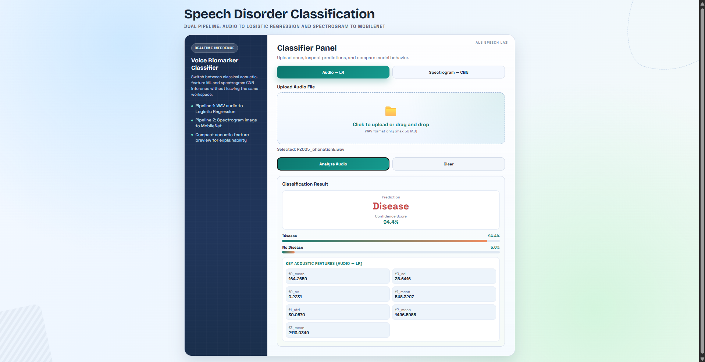
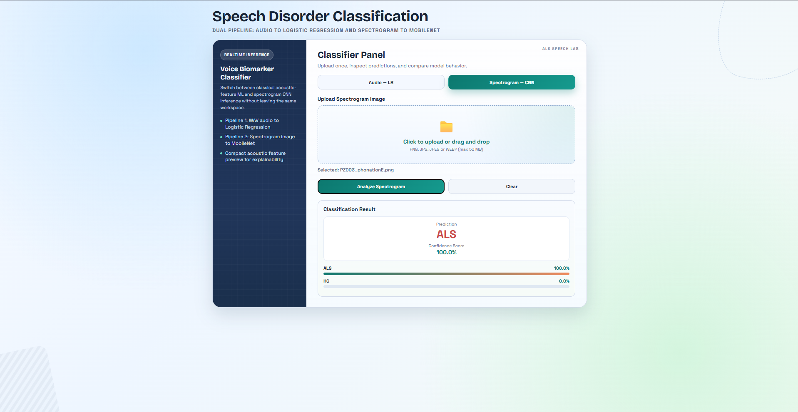

# ALS Speech Disorder Classification System

A machine learning project that detects Amyotrophic Lateral Sclerosis (ALS) from speech samples using acoustic feature analysis. The project includes multiple model approaches (traditional ML and deep learning) plus a web application for real-time predictions.

## Overview

This system analyzes voice recordings to classify whether a speaker has ALS or is healthy. We extract 115+ acoustic features from audio (pitch, formants, voice quality, etc.) and use trained models to make predictions. The project explores different modeling approaches to find the best accuracy.

## Dataset

**VOC-ALS Dataset**: 763 voice samples from patients with ALS and healthy controls
- **Vowels**: A, E, I, O, U
- **Split**: Training / Validation / Test
- **Features**: Audio spectrograms and extracted acoustic features
- **Metadata**: Age, sex, severity scores (in `VOC-ALS/metadata.csv`)

## Project Structure

### Core Components

- **Feature Extraction** (`extract_features.py`): Extracts 115+ acoustic features using Praat
- **Machine Learning Models**:
  - `train_logistic_regression.py` - Simple baseline model
  - `train_random_forest.py` - Tree-based model with feature importance
  - `train_xgboost.py` - Gradient boosting model
  - `train_svm.py` - Support Vector Machine
  - `train_lr_xgboost_top_features.py` - LR/XGBoost using selected features

- **Deep Learning CNN Models** (`CNNS/` folder):
  - **MobileNetV2**: Lightweight model optimized for speed and efficiency
  - **EfficientNet + ResNet-50**: Hybrid ensemble combining two powerful architectures
  - Both trained on spectrograms (augmented and standard)
  - Pre-trained weights fine-tuned on ALS dataset

- **Web Application** (`app.py`): Flask-based UI for uploading audio and getting predictions

### Datasets & Results

- `dataset/` - Preprocessed train/val/test splits with spectrograms
- `VOC-ALS/` - Raw dataset with voiced segments and spectrograms
- `*_results.csv` - Performance metrics for each model
- `*_features*.csv` - Feature importance and selection results

## Features Extracted

The system extracts several categories of acoustic features:

- **Fundamental Frequency (F0)**: Mean, median, standard deviation, quantiles, range
- **Formants (F1-F5)**: Frequency, bandwidth, slopes
- **Voice Quality**: Jitter, shimmer measurements
- **Harmonicity**: Harmonics-to-noise ratio (HNR)
- **Intensity**: Mean, standard deviation, coefficient of variation
- **MFCCs**: Mel-frequency cepstral coefficients
- **Temporal Features**: Complexity measures from trajectory analysis

## Deep Learning Models (CNN)

The project also explores deep learning approaches using convolutional neural networks trained on spectrograms:

### MobileNetV2
- Lightweight and fast inference
- Good for real-time deployment
- Trained on augmented spectrograms for better generalization
- Model files: `best_mobilenetv2_als_ft.pth`, `best_mobilenetv2_als_p1.pth`
- Development: `CNNS/MobileNet/mobilenetv2.ipynb`

### EfficientNet + ResNet-50 Hybrid
- More powerful ensemble combining two architectures
- EfficientNet: Optimized scaling across depth, width, and resolution
- ResNet-50: Deep residual network with skip connections
- Better accuracy at cost of increased computation
- Model files: `best_efficientnetv2-s_ft.pth`, `best_resnet-50_ft.pth`
- Development: `CNNS/EfficientNet + Resnet/ellficientnet+Resent.ipynb`

### Training Approach
- Models use transfer learning from ImageNet pre-trained weights
- Fine-tuned on VOC-ALS spectrograms (both standard and augmented)
- Backbone frozen initially, then fine-tuned based on performance
- Dropout regularization to prevent overfitting

## Web Application: Dual Pipeline Architecture

The web app implements a **dual pipeline approach**, letting you choose between two classification methods:

### Pipeline 1: Audio → Logistic Regression (LR)
- Upload raw `.wav` audio file
- System extracts 115+ acoustic features in real-time
- Fast inference (5-30 seconds depending on audio length)
- Provides confidence scores and key feature values

### Pipeline 2: Spectrogram → CNN (MobileNet)
- Upload spectrogram image (PNG, JPG, or JPEG)
- Deep learning model analyzes visual patterns
- Good for comparative analysis and validation
- Switch between pipelines without restarting


*Audio-based analysis with acoustic features displayed*


*Spectrogram-based CNN analysis with visual classification*

## Getting Started

### Requirements

```bash
pip install -r requirements_web.txt
```

Key dependencies: Flask, scikit-learn, XGBoost, PyTorch, Parselmouth, pandas

### Running the Web App

```bash
python app.py
```

Then open your browser to `http://localhost:5000`

**Choose pipeline** → **Upload file** → **Click Analyze** → **View results with confidence and probability distribution**

## Model Performance

Multiple approaches were tested to find the best balance between accuracy and performance:

**Traditional ML Models:**
- `logistic_regression_results.csv` - Fast, interpretable baseline
- `random_forest_results.csv` - Tree ensemble with feature importance
- `xgboost_results.csv` - Gradient boosting for better accuracy
- `svm_rbf_results.csv` - Support vector machine with RBF kernel
- `lr_xgboost_top_features_results.csv` - Models using selected important features

**Deep Learning Models:**
- MobileNetV2 - Fast inference, moderate accuracy
- EfficientNet + ResNet-50 - Highest accuracy, longer inference time

Each model was trained using 5-fold cross-validation and evaluated on the test set.

## Application Features

### User Interface
- **Tabbed Navigation**: Easy switching between Audio-LR and Spectrogram-CNN pipelines
- **Drag-and-Drop Upload**: Intuitive file upload with visual feedback
- **Clear Results Display**: 
  - Large prediction indicator (Disease/ALS or No Disease/HC)
  - Confidence percentage highlighted
  - Probability bar chart for both classes
- **Explainability** (Audio-LR only):
  - Shows top 4-6 contributing acoustic features
  - Displays actual feature values for interpretation
- **Reset Button**: Easily clear and start new analysis
- **Professional Design**: Clean, responsive interface

### Results Interpretation
- **Confidence Score**: 0-100% probability of the prediction
- **Probability Distribution**: Visual breakdown showing both class probabilities
- **Key Features** (LR only): Which acoustic measurements influenced the decision
- **Feature Values**: Actual numerical values extracted from the audio

### Technical Architecture
- **Frontend**: HTML/CSS responsive design (see `templates/index.html`)
- **Backend**: Flask server handling file uploads and processing
- **Feature Extraction**: Praat integration via Parselmouth library
- **Models**: Pre-trained pickled models loaded at startup

## Key Files

| File | Purpose |
|------|---------|
| `app.py` | Flask web application for predictions |
| `extract_features.py` | Acoustic feature extraction pipeline |
| `train_*.py` | Training scripts for different models |
| `feature_extraction_helpers/` | Praat scripts for voiced segment extraction |
| `CNNS/` | Deep learning notebooks and models |
| `VOC-ALS/` | Main dataset directory |

## How It Works

### Audio-LR Pipeline
1. **Input**: Upload `.wav` audio file
2. **Feature Extraction**: Praat automatically extracts 115+ acoustic features in real-time
3. **Prediction**: Logistic Regression model scores the extracted features
4. **Output**: 
   - Classification result (Disease / No Disease)
   - Confidence percentage
   - Probability distribution chart
   - Top contributing acoustic features displayed

### Spectrogram-CNN Pipeline
1. **Input**: Upload spectrogram image (PNG, JPG, JPEG)
2. **Processing**: Image fed to pre-trained MobileNet/EfficientNet model
3. **Prediction**: CNN classifies based on visual spectrogram patterns
4. **Output**:
   - Classification result (ALS / HC - Healthy Control)
   - Confidence percentage
   - Visual probability distribution

### Why Dual Pipeline?
- **Audio-LR**: Explainable results, shows which acoustic features matter most
- **Spectrogram-CNN**: Direct visual analysis, captures complex patterns
- **Comparison**: Compare predictions between methods for validation
- **Research**: Understand differences in how models interpret the same data

## Important Notes

### Supported Formats & Limitations
- **Audio**: `.wav` format only (max 50 MB)
- **Spectrogram Images**: PNG, JPG, JPEG (max 50 MB)
- **Processing Time**: 10-30 seconds for audio, <5 seconds for spectrogram
- **Audio Quality**: Best results with clear, noise-free recordings
- **Dataset Focus**: Model trained on vowel sounds (A, E, I, O, U)

### When to Use Each Pipeline
- **Audio-LR**: When you want to understand which acoustic features are important
- **Spectrogram-CNN**: For direct visual analysis or when you have pre-generated spectrograms
- **Both**: For validation and comparative analysis

### Accuracy Considerations
- Model trained on VOC-ALS dataset (763 samples)
- Results are predictions, not medical diagnoses
- Different audio quality/microphones may affect results
- Ensemble comparison (both pipelines) improves confidence

## Project Files

- `main.tex` - Academic paper about the project
- `methodology.html` - Detailed methodology documentation
- Jupyter notebooks in `CNNS/` - Deep learning model development

---

**Note**: Pre-trained models must be in the project root directory for the web app to function. The system uses the Logistic Regression model by default for audio pipeline and MobileNetV2 for spectrogram pipeline.

### Image References
Place `audio_lr_pipeline.png` and `spectrogram_cnn_pipeline.png` in the project root directory to display the interface examples in this README.
